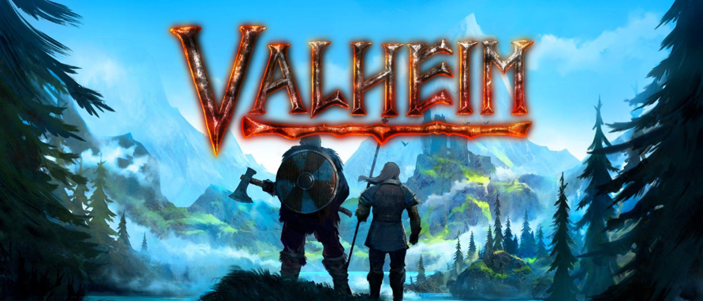

<!-- PROJECT LOGO -->
<br />
<p align="center">
  <a href="https://github.com/jaumebecks/valheim-virtual-server">
    
  </a>

  <h3 align="center">Valheim Virtual Server</h3>

  <p align="center">
    Using Vagrant & Virtualbox
    <br />
    <a href="https://github.com/jaumebecks/valheim-virtual-server/tree/main/docs"><strong>Explore the docs »</strong></a>
    <br />
    <br />
    <a href="https://github.com/jaumebecks/valheim-virtual-server/issues">Report Bug</a>
    ·
    <a href="https://github.com/jaumebecks/valheim-virtual-server/issues">Request Feature</a>
  </p>
</p>

<!-- TABLE OF CONTENTS -->
<details open="open">
  <summary><h2 style="display: inline-block">Table of Contents</h2></summary>
  <ol>
    <li>
      <a href="#about-the-project">About The Project</a>
      <ul>
        <li><a href="#built-with">Built With</a></li>
      </ul>
    </li>
    <li>
      <a href="#getting-started">Getting Started</a>
      <ul>
        <li><a href="#prerequisites">Prerequisites</a></li>
        <li><a href="#installation">Installation</a></li>
      </ul>
    </li>
    <li><a href="#usage">Usage</a></li>
    <li><a href="#roadmap">Roadmap</a></li>
    <li><a href="#contributing">Contributing</a></li>
    <li><a href="#contact">Contact</a></li>
    <li><a href="#acknowledgements">Acknowledgements</a></li>
  </ol>
</details>

<!-- ABOUT THE PROJECT -->

## About The Project

This project's purpose is to provide an easy to use infrastructure, for you to be able to create your own Valheim private server.

### Built With

- [Vagrant](https://www.vagrantup.com/) (I used version 2.2.14)
- [Vagrant ENV Plugin](https://www.rubydoc.info/gems/vagrant-env) (I used version 0.0.2)
- [VirtualBox](https://www.virtualbox.org/) (I used version 6.1)
- [Ubuntu/Bionic64 Vagrant Box](https://app.vagrantup.com/ubuntu/boxes/bionic64)

<!-- GETTING STARTED -->

## Getting Started

### Prerequisites

You'll need to install the following in order to be able to run the virtual server

- [Vagrant](https://www.vagrantup.com/docs/installation)
- [Vagrant ENV Plugin](https://www.rubydoc.info/gems/vagrant-env)
- [Virtualbox](https://www.virtualbox.org/wiki/Downloads)

### Installation
To get a local copy up and running follow these simple steps.

#### Virtual Machine Initialization

First, we'll create a Virtual Machine under your preffered OS, using Ubuntu18.

1. Clone the repo

   ```sh
   git clone https://github.com/jaumebecks/valheim-virtual-server.git
   ```

2. Go into project root

   ```sh
   cd valheim-virtual-server
   ```

3. Create a .env file from the existing one. **Important**: You may need to change some of the default variable to tune your environment. Refer to [docs/envvars](docs/envvars.md) and read how to tune your environment

   ```sh
   cp .env.dist .env
   ```

   > You'll find some configuration that can be tuned by changing some variables in `.env` file, but is highly reccommended to keep at least 2 Virtual CPUs and 8GB RAM

4. Run the application

   ```sh
   vagrant up
   ```

5. It will prompt you to which network interface to connect, select the interface connection to the internet

   > In my case it was the first one


#### Valheim Server Configuration

Reached this point, you'll have a Virtual machine running under your default OS. Now, we'll configure the Valheim Server inside the Virtual Machine.

1. First, we'll dive into the Virtual Machine

   ```sh
   vagrant ssh
   ```

   > You'll be now in your server, yay!

2. Now, run the `valheim-server.sh` inside the Virtual Machine

   ```sh
   sudo /vagrant/scripts/valheim-server.sh
   ```

   It will prompt you to accept some terms, please do it, and it will automatically install everything you need to run your server.

#### Port Forwarding

  As a last step, you need to open TCP/UDP ports 2456, 2457 & 2458. To do so, access your router's configuration (using your `GATEWAY_IP`). Refer to [docs#GUEST_IP](docs/envvars.md#GUEST_IP) to get more info.

  Once you have everything set up, run `vagrant reload` in project root, and you'll be ready to serve your awesome world through a Virtual Machine!

<!-- USAGE EXAMPLES -->

## Usage

- Run the Virtual Machine & Valheim Server

  ```
  vagrant up
  ```

- Access Virtual Machine

  ```
  vagrant ssh
  ```

- Restart the Virtual Machine & Valheim Server

  ```
  vagrant reload
  ```

- Suspend Virtual Machine

  ```
  vagrant suspend
  ```

- Halt Virtual Machine

  ```
  vagrant halt
  ```

- Destroy Virtual Machine & all its contents

  ```
  vagrant destroy
  ```

<!-- ROADMAP -->

## Roadmap

See the [open issues](https://github.com/jaumebecks/valheim-virtual-server/issues) for a list of proposed features (and known issues).

<!-- CONTRIBUTING -->

## Contributing

Contributions are what make the open source community such an amazing place to be learn, inspire, and create. Any contributions you make are **greatly appreciated**.

1. Fork the Project
2. Create your Feature Branch (`git checkout -b feature/AmazingFeature`)
3. Commit your Changes (`git commit -m 'Add some AmazingFeature'`)
4. Push to the Branch (`git push origin feature/AmazingFeature`)
5. Open a Pull Request

<!-- CONTACT -->

## Contact

Jaume Jiménez - [@jaumebecks](https://twitter.com/jaumebecks)

Project Link: [https://github.com/jaumebecks/valheim-virtual-server](https://github.com/jaumebecks/valheim-virtual-server)

[![LinkedIn][linkedin-shield]][linkedin-url]

<!-- ACKNOWLEDGEMENTS -->

## Acknowledgements

- [Geekhead](https://www.youtube.com/channel/UCG4EFg9NAskd3X7RoyiomuA)
- [IronGate](https://irongatestudio.se)

<!-- MARKDOWN LINKS & IMAGES -->
<!-- https://www.markdownguide.org/basic-syntax/#reference-style-links -->

[linkedin-shield]: https://img.shields.io/badge/-LinkedIn-black.svg?style=for-the-badge&logo=linkedin&colorB=555
[linkedin-url]: https://linkedin.com/in/jaume-jimenez-forteza
